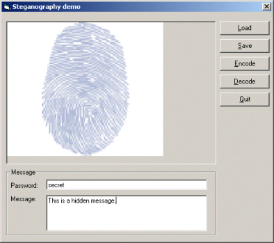



## Steganography demo

### Description

This project demonstrates steganography.

Steganography is a method to hide something in something else.

In this case we hide a text message in a picture.

The need for steganography will probably increase the next few years,

because governments want to restrict cryptography.

Steganography allows you to send your secrets in a picture, making it

less suspicious.

It is very hard (impossible?) to detect if there is a message hidden

in a picture using this method, because the locations where the bits

are stored are determined by a password. Without this password you

cannot tell where the bits are stored.

Please vote for this code if you like it!
 
### More Info
 

             |
---                |---
**Submitted On**   |2001-11-08 16:44:12
**By**             |[Robin Schuil](https://github.com/Planet-Source-Code/PSCIndex/blob/master/ByAuthor/robin-schuil.md)
**Level**          |Advanced
**User Rating**    |4.8 (77 globes from 16 users)
**Compatibility**  |VB 4\.0 \(32\-bit\), VB 5\.0, VB 6\.0
**Category**       |[Encryption](https://github.com/Planet-Source-Code/PSCIndex/blob/master/ByCategory/encryption__1-48.md)
**World**          |[Visual Basic](https://github.com/Planet-Source-Code/PSCIndex/blob/master/ByWorld/visual-basic.md)
**Archive File**   |[Steganogra340231182001\.zip](https://github.com/Planet-Source-Code/robin-schuil-steganography-demo__1-28747/archive/master.zip)

